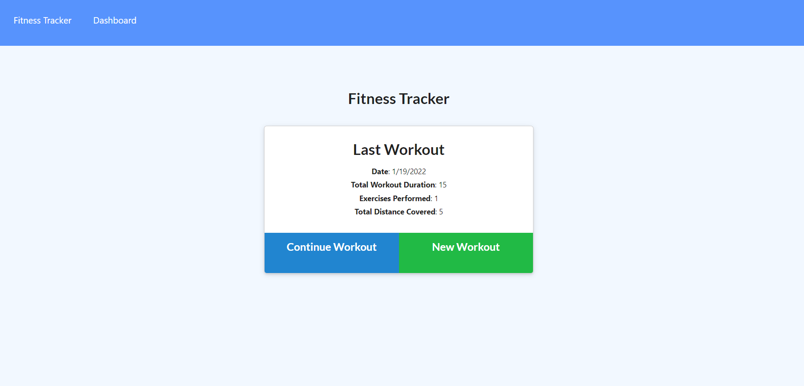

# Fitness-Tracker

  ## Description
  Keep track of your fitness stats and workout rutines!

  # Table of Contents
 [Installation](#install)
 [Test](#test)
 [Usage](#usage)
 [Tech](#tech)
 [Deployment](#deployment)
 [License](#license)
 [Contributions](#contributions)
 [Contact](#contact)

  ## Installation
  npm i
  
  ## Test
  npm test

  ## Usage
  1. Click add a new workout
  2. insert your last workout stats
  3. Click stats to view your lifelong stats

  ## Tech
  - JavaScript
  - mongodb

  ## Deployment
  https://github.com/QuentinHnilica/fitness-tracker

  ## License  (https://opensource.org/licenses/MIT)

  ## Contributions
  This was a solo Project
  
  ## Contact
  for any questions or inquaries send me an email at Quentinhnilica@gmail.com and follow [my Github](https://www.github.com/quentinhnilica)
